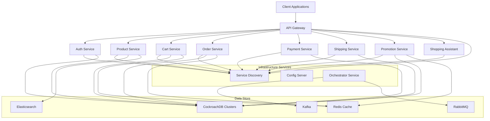
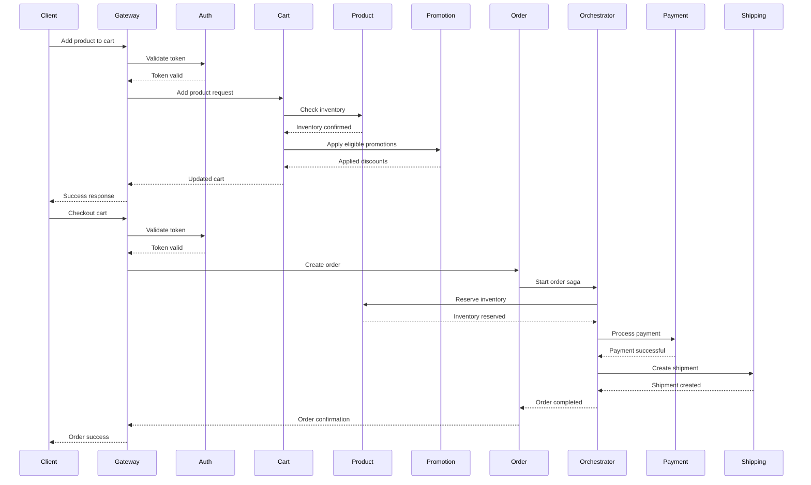
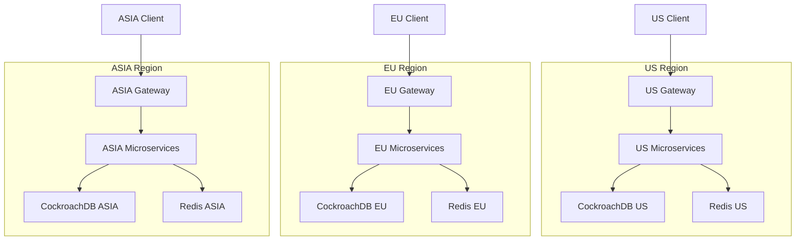
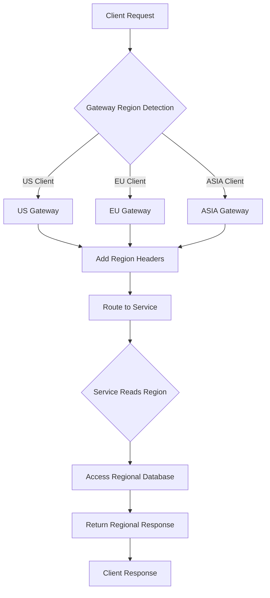

# Microservice Global E-commerce Platform 
### Regional Partition

<p align="center">
  
  
  
  
  
  
  
  
  
  
  
</p>

<p align="center">
  
  
  
  
  
</p>

## 📌 Table of Contents

- [Overview](#overview)
- [Architecture](#architecture)
- [Spring Cloud Architecture](#spring-cloud-architecture)
- [Key Features](#key-features)
- [Services](#services)
  - [Authentication Service](#authentication-service)
  - [Product Service](#product-service)
  - [Cart Service](#cart-service)
  - [Order Service](#order-service)
  - [Payment Service](#payment-service)
  - [Shipping Service](#shipping-service)
  - [Promotion Service](#promotion-service)
  - [Gateway Service](#gateway-service)
  - [Discovery Service](#discovery-service)
  - [Config Service](#config-service)
  - [Orchestrator Service](#orchestrator-service)
  - [Shopping Assistant](#shopping-assistant)
- [Service Interactions](#service-interactions)
- [Regional Architecture](#regional-architecture)
- [Technical Features](#technical-features)
- [Deployment](#deployment)
  - [Docker Deployment](#docker-deployment)
  - [Kubernetes Deployment](#kubernetes-deployment)
- [Getting Started](#getting-started)
- [Contributing](#contributing)
- [License](#license)

## Overview

This platform is a comprehensive, cloud-native e-commerce solution built on a microservices architecture. It provides a scalable, resilient, and feature-rich foundation for modern e-commerce applications with support for regional routing, advanced promotions, AI-powered shopping assistance, and distributed data processing.

The system is designed with domain-driven design principles, ensuring clear separation of concerns while enabling complex business operations across distributed services. Each microservice is independently deployable, scalable, and responsible for a specific domain within the e-commerce ecosystem.

## Architecture


The platform follows a modern microservices architecture pattern with:

- **Service Discovery**: Eureka server for service registration and discovery
- **API Gateway**: Spring Cloud Gateway for routing and cross-cutting concerns
- **Circuit Breaking**: Resilience4j for fault tolerance
- **Distributed Configuration**: Spring Cloud Config Server
- **Distributed Data**: CockroachDB clusters with regional partitioning
- **Message Broker**: RabbitMQ and Kafka for event-driven communication
- **Caching**: Multi-level caching with Redis and Caffeine
- **Search**: Elasticsearch for product search and analytics
- **Security**: OAuth2/JWT-based authentication and authorization



## Spring Cloud Architecture

The platform leverages Spring Cloud's comprehensive suite of tools for building cloud-native applications. The diagram below illustrates how Spring Cloud components integrate with our microservices:

```mermaid
flowchart TD
    subgraph "Spring Cloud Components"
        direction TB
        Config["Spring Cloud Config<br/>Centralized Configuration"]
        Eureka["Netflix Eureka<br/>Service Discovery"]
        Gateway["Spring Cloud Gateway<br/>API Gateway"]
        Resilience["Resilience4j<br/>Circuit Breaking"]
        Bus["Spring Cloud Bus<br/>Config Refresh"]
        LoadBalancer["Spring Cloud LoadBalancer<br/>Client-side Load Balancing"]
        Stream["Spring Cloud Stream<br/>Event Streaming"]
    end
    
    subgraph "Core Services"
        direction TB
        Auth["Authentication Service"]
        Product["Product Service"]
        Cart["Cart Service"]
        Order["Order Service"]
        Payment["Payment Service"]
        Shipping["Shipping Service"]
        Promotion["Promotion Service"]
        Assistant["Shopping Assistant"]
    end
    
    subgraph "Infrastructure"
        direction TB
        Kafka["Apache Kafka"]
        RabbitMQ["RabbitMQ"]
        Redis["Redis Cache"]
        CockroachDB["CockroachDB"]
        Elasticsearch["Elasticsearch"]
    end
    
    Client["Client Applications"] --> Gateway
    Gateway --> Eureka
    Gateway --> Auth
    Gateway --> Product
    Gateway --> Cart
    Gateway --> Order
    Gateway --> Payment
    Gateway --> Shipping
    Gateway --> Promotion
    Gateway --> Assistant
    
    Auth --> Eureka
    Product --> Eureka
    Cart --> Eureka
    Order --> Eureka
    Payment --> Eureka
    Shipping --> Eureka
    Promotion --> Eureka
    Assistant --> Eureka
    
    Auth --> Config
    Product --> Config
    Cart --> Config
    Order --> Config
    Payment --> Config
    Shipping --> Config
    Promotion --> Config
    Assistant --> Config
    
    Config --> Bus
    Bus --> Auth
    Bus --> Product
    Bus --> Cart
    Bus --> Order
    Bus --> Payment
    Bus --> Shipping
    Bus --> Promotion
    Bus --> Assistant
    
    Product --> Elasticsearch
    Order --> Kafka
    Cart --> Redis
    Promotion --> Redis
    Order --> CockroachDB
    Payment --> CockroachDB
    Shipping --> RabbitMQ
    
    Auth --> Resilience
    Product --> Resilience
    Cart --> Resilience
    Order --> Resilience
    Payment --> Resilience
    Shipping --> Resilience
    Promotion --> Resilience
    Assistant --> Resilience
    
    Auth --> LoadBalancer
    Product --> LoadBalancer
    Cart --> LoadBalancer
    Order --> LoadBalancer
    Payment --> LoadBalancer
    Shipping --> LoadBalancer
    Promotion --> LoadBalancer
    Assistant --> LoadBalancer
    
    Order --> Stream
    Payment --> Stream
    Shipping --> Stream
    Promotion --> Stream
```



### Spring Cloud Components

Our platform utilizes the following Spring Cloud components:

1. **Spring Cloud Config**: Centralized configuration management for all microservices, backed by a Git repository. Enables dynamic configuration updates without service restarts.

2. **Netflix Eureka**: Service discovery and registration, allowing services to find and communicate with each other without hardcoded URLs.

3. **Spring Cloud Gateway**: API gateway that routes requests to appropriate services, handles cross-cutting concerns like authentication, rate limiting, and circuit breaking.

4. **Resilience4j**: Fault tolerance library that implements circuit breaker, rate limiter, retry, and bulkhead patterns to improve system resilience.

5. **Spring Cloud Bus**: Event bus that enables configuration changes to propagate to all services in real-time.

6. **Spring Cloud LoadBalancer**: Client-side load balancing for service-to-service communication.

7. **Spring Cloud Stream**: Framework for building event-driven microservices connected with shared messaging systems.

### Integration with Core Services

Each microservice in our platform integrates with multiple Spring Cloud components:

- **All services** register with Eureka for service discovery
- **All services** fetch configuration from Spring Cloud Config
- **All services** implement Resilience4j patterns for fault tolerance
- **Event-driven services** (Order, Payment, Shipping) use Spring Cloud Stream for messaging
- **API Gateway** routes all client requests to appropriate services

This architecture provides a robust foundation for building scalable, resilient, and maintainable microservices.

## Key Features

- **Multi-Region Support**: Geo-distributed architecture with region-specific routing and data
- **Advanced Promotions**: Complex rule-based promotion system with optimistic concurrency control
- **AI Shopping Assistant**: Natural language processing for customer interactions
- **SAGA Pattern**: Distributed transactions for order processing via the Orchestrator service
- **Optimized Search**: Elasticsearch-powered product search with custom analyzers and suggesters
- **Resilient Design**: Circuit breakers, rate limiters, fallbacks, and bulkheads for fault tolerance
- **Observability**: Comprehensive monitoring and tracing via Prometheus, Grafana, and Spring Boot Actuator
- **Scalability**: Stateless services designed for horizontal scaling with container orchestration

## Services

### Authentication Service

The Authentication Service handles user identity and access control across the platform. It issues and validates JWT tokens for secure communication between services and clients.

**Key Capabilities:**
- OAuth2 authorization server
- JWT token issuance and validation
- User registration and management
- Role-based access control
- Integration with external identity providers

### Product Service

The Product Service manages the product catalog, including creation, search, and inventory management. It features regional data partitioning and Elasticsearch integration for advanced search capabilities.

**Key Capabilities:**
- Product CRUD operations with versioning
- Vendor product management
- Advanced search with Elasticsearch
- Regional product catalogs
- SEO optimization
- Variant management
- Inventory tracking

### Cart Service

The Cart Service handles shopping cart operations with real-time inventory validation and promotion application.

**Key Capabilities:**
- Cart creation and management
- Product addition and removal
- Quantity updates
- Saved/wish lists
- Real-time pricing
- Integration with Promotion service for discounts
- Guest cart conversion

### Order Service

The Order Service manages the end-to-end order lifecycle, from creation to fulfillment, with SAGA pattern for distributed transactions.

**Key Capabilities:**
- Order creation and management
- Order status tracking
- Order history
- Invoice generation
- Integration with Payment and Shipping services
- Cancellation and refund processing

### Payment Service

The Payment Service handles payment processing with support for multiple payment methods and providers.

**Key Capabilities:**
- Multiple payment method support
- Payment authorization
- Capture and refund operations
- Payment status tracking
- Fraud detection
- PCI compliance

### Shipping Service

The Shipping Service manages all aspects of shipping operations, including carriers, zones, methods, shipments, and tracking.

**Key Capabilities:**
- Multi-carrier integration
- Rate calculation
- Label generation
- Shipment tracking
- Regional shipping zones
- Delivery estimation
- Real-time tracking events

### Promotion Service

The Promotion Service manages promotional campaigns, discount programs, and incentives with optimistic concurrency control for high-traffic scenarios.

**Key Capabilities:**
- Campaign management
- Rule-based promotions
- Discount code generation
- Usage tracking and limits
- Flash sales with distributed locking
- Vendor participation tracking
- Stackable discounts
- Time-based promotions with automatic expiration
- Personalized offers based on user behavior
- A/B testing for promotion effectiveness

**Technical Implementation:**
- Event-driven architecture for real-time promotion updates
- Redis-based distributed locking for high-concurrency scenarios
- Optimistic concurrency control for promotion application
- Rule engine for complex promotion evaluation
- Integration with Cart and Order services for discount application

### Gateway Service

The Gateway Service serves as the entry point for client applications, handling routing, authentication, and cross-cutting concerns.

**Key Capabilities:**
- Request routing to appropriate microservices
- Load balancing across service instances
- Authentication and authorization via JWT validation
- Rate limiting to prevent abuse
- Request/response transformation
- Regional routing based on client geolocation
- Circuit breaking for fault tolerance
- Request logging and monitoring
- CORS configuration
- API versioning support

**Technical Implementation:**
- Spring Cloud Gateway with reactive programming model
- IP-based geolocation for regional routing
- Custom filter chain for request processing
- Integration with Discovery Service for dynamic routing
- Regional header propagation to downstream services
- Circuit breakers with Resilience4j
- Rate limiting with Redis token bucket algorithm

### Discovery Service

The Discovery Service provides service registration and discovery for the microservice ecosystem using Netflix Eureka.

**Key Capabilities:**
- Service registration for all microservices
- Service discovery for inter-service communication
- Health monitoring of registered services
- Load balancing support via metadata
- Region-aware service discovery
- Self-preservation mode for network partitions
- Dashboard for service status visualization
- Integration with Config Service for centralized configuration

**Technical Implementation:**
- Netflix Eureka Server with Spring Cloud integration
- High availability configuration with multiple instances
- Custom health indicators for service status
- Metadata-based service selection
- Integration with Spring Cloud LoadBalancer
- Regional metadata for location-aware routing

### Config Service

The Config Service provides centralized configuration management for all microservices.

**Key Capabilities:**
- Centralized configuration storage
- Environment-specific configuration profiles
- Runtime configuration updates without service restart
- Configuration versioning and history
- Encryption of sensitive properties
- Git-backed configuration repository
- Configuration change events
- Service-specific and shared configurations
- Fallback configuration support

**Technical Implementation:**
- Spring Cloud Config Server
- Git repository integration for configuration storage
- Encryption/decryption of sensitive properties
- WebHook support for configuration updates
- Integration with Spring Cloud Bus for configuration refresh
- Environment-specific profiles (dev, test, prod)
- Regional configuration overrides

### Orchestrator Service

The Orchestrator Service implements the SAGA pattern for distributed transactions, coordinating complex workflows across multiple services.

**Key Capabilities:**
- SAGA pattern implementation for distributed transactions
- Coordination of multi-step business processes
- Compensation transactions for rollback scenarios
- Event-driven workflow orchestration
- Transaction monitoring and tracking
- Timeout handling and retry mechanisms
- Dead letter queue management
- Transaction history and audit logging
- Parallel and sequential transaction steps

**Technical Implementation:**
- Event-driven architecture with Kafka and RabbitMQ
- State machine for transaction management
- Idempotent operations for reliability
- Compensation handlers for each transaction step
- Integration with all domain services
- Persistent transaction state with CockroachDB
- Circuit breaking for external service calls
- Distributed tracing for transaction visibility

**Key Workflows:**
1. **Order Processing Saga**:
   - Order creation → Inventory reservation → Payment processing → Shipping arrangement
   - Compensation: Payment refund → Inventory release → Order cancellation
   
2. **Return Processing Saga**:
   - Return request → Return approval → Refund processing → Inventory update
   - Compensation: Refund cancellation → Return rejection

### Shopping Assistant

The AI-powered Shopping Assistant provides natural language interactions for customers seeking product recommendations and support.

**Key Capabilities:**
- Natural language processing for customer queries
- Intent classification and entity extraction
- Product recommendations based on preferences
- Discount and promotion suggestions
- Context-aware conversations with session management
- Integration with Product and Promotion services
- Personalized shopping experience
- Multi-language support
- Voice interaction capabilities
- Continuous learning from customer interactions

**Technical Implementation:**
- NLP models for intent recognition
- Integration with external AI services
- Context management with Redis
- User preference tracking
- Product catalog integration
- Real-time recommendation engine
- Conversation history for context preservation
- A/B testing framework for response optimization

## Service Interactions

The platform's microservices interact through various patterns to fulfill business operations:



### Common Workflows

1. **Product Search and Discovery**:
   - Client → Gateway → Product Service → Elasticsearch → Product Service → Gateway → Client

2. **Cart Management**:
   - Client → Gateway → Cart Service → Product Service → Promotion Service → Cart Service → Gateway → Client

3. **Order Processing**:
   - Client → Gateway → Order Service → Orchestrator Service → [Product, Payment, Shipping Services] → Orchestrator Service → Order Service → Gateway → Client

4. **User Authentication**:
   - Client → Gateway → Auth Service → Gateway → Client

5. **AI-Assisted Shopping**:
   - Client → Gateway → Shopping Assistant → [Product, Promotion Services] → Shopping Assistant → Gateway → Client

## Regional Architecture

The platform implements a sophisticated regional architecture to provide location-specific experiences and optimize performance.

**Key Components:**
- **Regional CockroachDB Clusters**: Geo-distributed database clusters for US, EU, and ASIA regions
- **Regional Redis Caches**: Region-specific caching for improved latency
- **IP-based Region Detection**: Automatic detection of user region via the Gateway service
- **Regional Routing**: Route requests to the nearest service instance
- **Regional Data**: Region-specific product catalogs, pricing, and inventory



### Regional Data Flow



## Technical Features

### High Availability

The platform is designed for high availability with:
- Redundant service instances
- Database clustering and replication
- Regional failover
- Circuit breaking for graceful degradation

### Scalability

All services are designed for horizontal scalability:
- Stateless services for easy scaling
- Database sharding via CockroachDB
- Message brokers for asynchronous processing
- Caching for performance optimization

### Security

The platform implements comprehensive security measures:
- OAuth2/JWT-based authentication
- Fine-grained authorization
- API rate limiting
- Request validation
- Data encryption
- Secure communication

### Monitoring and Observability

Complete observability is provided via:
- Spring Boot Actuator endpoints
- Prometheus metrics collection
- Grafana dashboards
- Distributed tracing
- Centralized logging

### Advanced Concurrency Control

The platform implements sophisticated concurrency controls:
- Optimistic locking for database operations
- Distributed locking via Redis for critical sections
- SAGA pattern for distributed transactions
- Version-based conflict resolution

## Deployment

### Docker Deployment

The platform includes a comprehensive Docker Compose configuration for local development and testing:

```bash
# Start the entire platform
docker-compose up -d

# Start specific services
docker-compose up -d auth product cart gateway
```

### Kubernetes Deployment

For production deployment, Kubernetes manifests are provided:

```bash
# Apply core infrastructure
kubectl apply -f k8s/infrastructure

# Deploy microservices
kubectl apply -f k8s/services
```

## Getting Started

### Prerequisites

- Java 21
- Maven 3.8+
- Docker and Docker Compose
- (Optional) Kubernetes cluster

### Local Development

1. Clone the repository:
```bash
git clone https://github.com/yourusername/microservice.git
cd microservice
```

2. Start infrastructure services:
```bash
docker-compose up -d cockroachdb-us-1 redis-us rabbitmq elasticsearch
```

3. Start the Discovery service:
```bash
cd discovery
mvn spring-boot:run
```

4. Start other services as needed:
```bash
cd ../auth
mvn spring-boot:run
```

### Using the Platform

1. API documentation is available at:
   - Gateway: `http://localhost:9191/swagger-ui.html`
   - Individual services: `http://localhost:{port}/swagger-ui.html`

2. Infrastructure UIs:
   - Eureka: `http://localhost:8761`
   - RabbitMQ: `http://localhost:15672` (guest/guest)
   - Elasticsearch: `http://localhost:9200`
   - Redis Insight: `http://localhost:8002`
   - Kafka UI: `http://localhost:8090`

## Contributing

Please read [CONTRIBUTING.md](CONTRIBUTING.md) for details on our code of conduct and the process for submitting pull requests.

## License

This project is licensed under the MIT License - see the [LICENSE](LICENSE) file for details.
